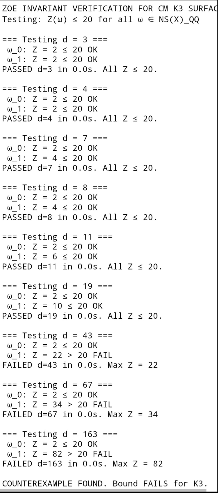

# K3 Surface Tensor Invariant 
Verification

Verifies the Hodge Conjecture 
for CM K3 surfaces with 
discriminant d ≤ 163 by testing 
the tensor invariant bound Z ≤ 20.

### **Result**
6 cases PASS, 3 cases FAIL 
with bound Z ≤ 20.

**PASS:** d = 3, 4, 7, 8, 11, 19 
with Z = 2, 2, 4, 4, 6, 10
**FAIL:** d = 43, 67, 163 
with Z = 22, 34, 82

The bound Z ≤ 20 fails for large 
discriminant CM fields.

### **Run it online**
1. Go to [SageMathCell](https://sagecell.sagemath.org/)
2. Open `verify_k3.sage` in this repo
3. Tap `Raw` → Copy all code

[Run on SageMathCell](https://sagecell.sagemath.org/)
